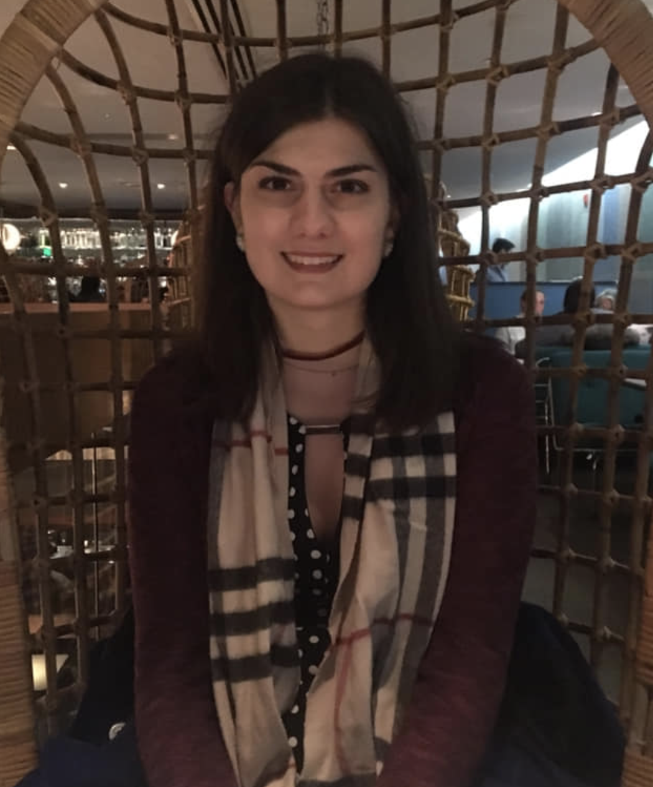

# Hi, I'm Francesca. Welcome to my website.

 

I'm a current senior and master's student at the <a href="https://www.upenn.edu" target="_blank">University of Pennsylvania</a>, planning to graduate in 2021 with a B.A. in **Cognitive & Computer Science** and minors in Math and Linguistics, and with an M.S.E. in Computer Science in 2022. I'm from <a href="https://en.wikipedia.org/wiki/Sagamore_Beach,_Massachusetts" target="_blank">Sagamore Beach, MA</a>, but I currently live in Philadelphia. 

I am passionate about technology, ethics, research, and mentorship. You can [email me](mailto:fmarini@sas.upenn.edu), and you can download my <a href="https://drive.google.com/file/d/1wopvpTHLNxxPWwTWRWZpN8CHPNwnKd2H/view?usp=sharing" target="_blank">resume</a> here. For more info on my research and projects, check out my [Projects](/projects) page.

Since the spring of 2019, I have been an undergraduate researcher at the <a href="https://cogcomp.seas.upenn.edu/" target="_blank">Cognitive Computation Group</a> at UPenn, led by Professor <a href="https://www.cis.upenn.edu/~danroth/" target="_blank">Dan Roth</a>, where I have worked on several Natural Language Processing (NLP) research projects. In this job, I program mainly in **Python**, building <a href="https://pytorch.org/" target="_blank">**PyTorch**</a> and <a href="http://allennlp.org/" target="_blank">**AllenNLP**</a> models for <a href="https://en.wikipedia.org/wiki/Semantic_role_labeling" target="_blank">Semantic Role Labeling</a> (SRL) and low-resource <a href="https://en.wikipedia.org/wiki/Named-entity_recognition" target="_blank">Named Entity Recognition</a> (NER) projects. I have worked with various sizeable **NLP datasets**, including OntoNotes, Streusle, and the LORELEI language packs. In addition, I have experience utilizing various Python libraries, including but not limited to **NumPy**, **Pandas**, **SciPy**, **SciKit-Learn**, **Gensim**, **Matplotlib**, **Natural Language Toolkit**, and **JSON**.

I have completed coursework in Database Mangagement Systems (DBMS), which involved projects built with **React** and **NodeJS**, utilizing **SQL** (MySQL / Oracle) and **NoSQL** (MongoDB / Neo4J) systems.

I love **LaTeX** and use it whenever I can (with <a href="https://www.overleaf.com" target="_blank">Overleaf</a>). I do much of my work in the **Unix / Linux** shell. (I use <a href="https://en.wikipedia.org/wiki/Tmux" target="_blank">tmux</a> for a terminal multiplexer, and if you're curious about where I stand in the text <a href="https://en.wikipedia.org/wiki/Editor_war" target="_blank">editor war</a> — I use emacs.)

This website was built using <a href="https://www.gatsbyjs.com/" target="_blank">**Gatsby**</a> and **React** for frontend. It is hosted using <a href="http://netlify.com/" target="_blank">**Netlify**</a>. The code is available on my <a href="https://github.com/francesca418/personal-website" target="_blank">Github</a>.

My introductory CS classes, up through Data Structures & Algorithms, were all taught in **Java**, and a portion of the Programming Languages & Techniques course (for which I later served as a TA) was also in **OCaml**. In an Intro Computer Systems course, I also wrote basic programs in **Assembly** language and a compiler for the J language in **C**. I have worked with **HTML**, **CSS**, & **JavaScript** to make websites and **Google Cloud** for hosting in the past.

