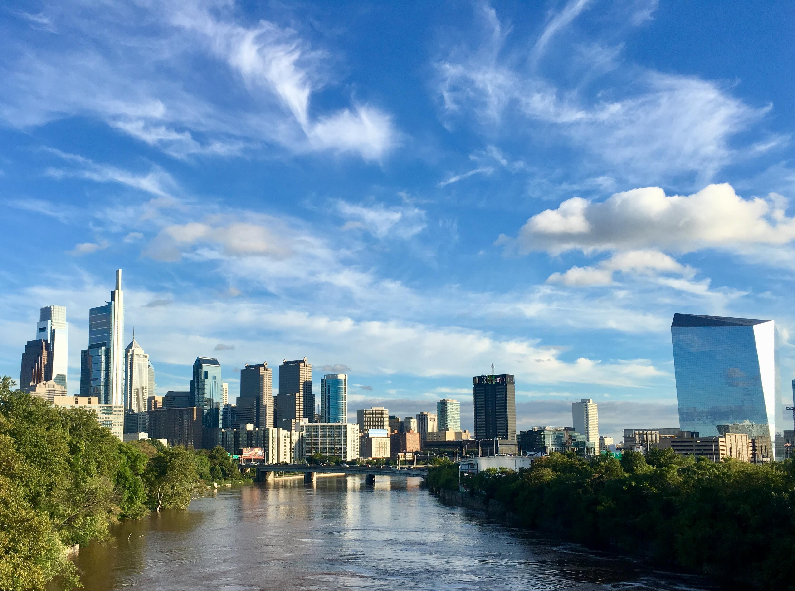

# University of Pennsylvania

  
<b>Candidate for M.S.E., Computer & Information Science, 2022</b>

  <h3>School of Engineering & Applied Science</h3>
   
 <h3>GPA: 3.85 / 4.00</h3>
 
 
  <h4>Coursework:</h4>
  <ul style="list-style-type:none;">
    <li>CIS 519: Applied Machine Learning</li>
    <li>CIS 530: Computational Linguistics</li>
    <li>CIS 550: Database & Information Systems</li>
</ul>

  
<b>Candidate for B.A., Cognitive Science & Computer Science, 2021</b>

   <h3>College of Arts & Sciences</h3> 
  <h3>Concentration: Computation & Cognition</h3> 
  <h3>Minors: Mathematics & Linguistics</h3> 
  <h3>GPA: 3.94 / 4.00</h3> 
   
  <h4>Awards & Honors:</h4> 
  <ul style="list-style-type:none;">
    <li>Dean's List, 2017 - Present</li>
    <li>Google CSR Research Fellow, 2019</li>
    <li>Summer Research Paleontology Stipend Recipient, 2018</li>
</ul>
<h4>Computer Science Coursework:</h4> 
<ul style="list-style-type:none;">
    <li>CIS 099: Independent Study / Research</li>
    <li>CIS 110: Introduction to Computer Programming</li>
    <li>CIS 120: Computer Programming Techniques</li>
    <li>CIS 160: Discrete Mathematics</li>
    <li>CIS 121: Datastructures & Algorithms</li>
    <li>CIS 240: Introduction to Computer Systems</li>
    <li>CIS 262: Automata, Computability, & Complexity</li>
    <li>CIS 320: Algorithms</li>
    <li>CIS 519: Applied Machine Learning</li>
    <li>CIS 530: Computational Linguistics</li>
    <li>CIS 550: Database & Information Systems</li>
    <li>CIS 571: Computer Organization & Design</li>
</ul>
<h4>Cognitive Science Coursework:</h4> 
<ul style="list-style-type:none;">
    <li>BIBB 030: Neurobiology of Brain Disorders</li>
    <li>BIBB 249: Cognitive Neuroscience</li>
    <li>CIS 140: Introduction to Cognitive Science</li>
    <li>LING 106: Formal Linguistics</li>
    <li>LING 151: Language & Thought</li>
    <li>LING 250: Syntax</li>
    <li>LING 270: Language Acquisition</li>
    <li>OIDD 290: Decision Processes</li>
    <li>PSYC 001: Introduction to Experimental Psychology</li>
</ul>
<h4>Other Quantitative Coursework:</h4> 
<ul style="list-style-type:none;">
    <li>ASTR 006: Solarsystems & Exoplanets</li>
    <li>ECON 001: Microeconomics</li>
    <li>ECON 002: Macroeconomics</li>
    <li>ENVS 100: Introduction to Environmental Science</li>
    <li>ESE 301: Engineering Probability & Statistics</li>
    <li>MATH 104: Calculus I (AP Credit)</li>
    <li>MATH 116: Honors Calculus</li>
    <li>MATH 240: Linear Algebra & Differential Equations (Placement Test Credit)</li>
    <li>MATH 313: Computational Linear Algebra</li>
    <li>PHYS 101: General Physics with Lab (AP Credit)</li>
</ul>
<h4>Humanities & Social Science Coursework:</h4> 
<ul style="list-style-type:none;">
    <li>CIMS 102: World Film History: 1945 - Present</li>
    <li>GSWS 002: Gender & Society</li>
    <li>HIST 135: Cold War: A Global History</li>
    <li>LATN 204: Intermediate Latin Poetry</li>
    <li>PHIL 002: Philosophical Ethics</li>
    <li>PHIL 004: History of Modern Philosophy</li>
    <li>PSYC 170: Social Psychology</li>
</ul>

# Bishop Stang High School

  
<b>High School Diploma, Valedictorian, 2017</b>

  <h3>Weighted GPA: 4.25 / 4.00</h3> 
  <h3>ACT: 35 / 36</h3> 
   
<h4>Awards & Honors:</h4> 
<ul style="list-style-type:none;">
    <li>Valedictorian, 2017</li>
    <li>AP Scholar with Distinction, 2017</li>
    <li>Class Board, Secretary (Elected), 2015 - 2017</li>
    <li>National Honor Society, Treasurer (Elected), 2015 - 2017</li>
    <li>Math Team, Co-Captain (Appointed), 2015 - 2017</li>
    <li>National Merit Commended Scholar, 2016</li>
    <li>Harvard Book Award, 2016</li>
    <li>United States Figure Skating Gold Medalist, Moves in the Field, 2016</li>
    <li>Anthony Fernandes Sportsmanship Award, Falmouth Figure Skating Club, 2016</li>
    <li>Scholastic Art Awards, Honorable Mention, 2013; 2015</li>
    <li>Massachusetts Regional Science Fair, 3rd Place, 2014</li>
    <li>Scholastic Art Awards, Silver Key, 2013</li> 
</ul>
<h4>Advanced Placement Coursework:</h4> 
<ul style="list-style-type:none;">
    <li>Biology</li>
    <li>Calculus A/B</li>
    <li>Calculus B/C</li>
    <li>English Language & Composition</li>
    <li>English Literature & Composition</li>
    <li>Physics I</li>
    <li>Physics II</li>
    <li>Statistics</li>
    <li>United States History</li>
</ul>
<h4>Clubs & Activities:</h4> 
<ul style="list-style-type:none;">
    <li>Figure Skating</li>
    <li>Theater on Ice</li>
    <li>Visual Arts</li>
    <li>Math Team</li>
    <li>Student Council</li>
    <li>National Honor Society</li>
    <li>Peer Mentor</li>
</ul>

