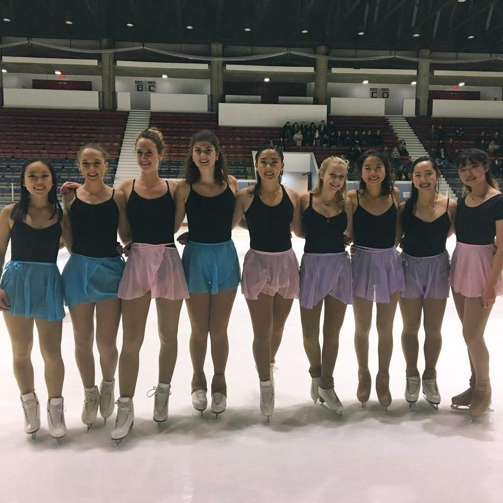
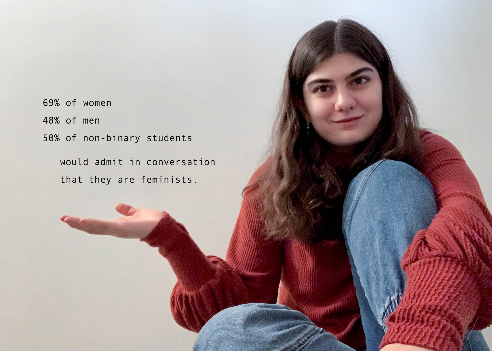
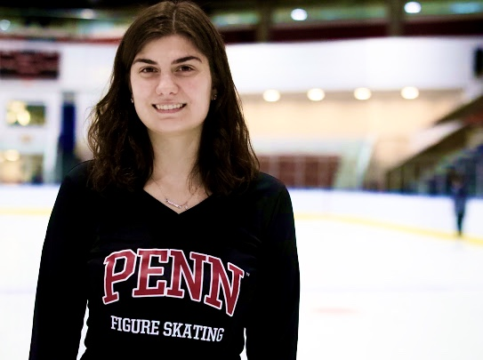

# Clubs & Leadership

  
<b>Univ. of Penn. Figure Skating Club</b>

  <h3>Founding Executive Board Member</h3>
 

<ul style="list-style-type:none;">
    <li>The <a href="https://upennfigureskating.wixsite.com/upennfigureskating" target="_blank"><b>UPenn Figure Skating Club</b></a> serves both the Penn and Drexel University student bodies. I was a member of the club's founding board. In my first year, I was <b>Treasurer</b> for the club, and for the following two years I served as <b>Show Director</b>.</li>
    <li>I have directed the production of <b>four large-scale figure skating performances</b>. This involved coordinating rehearsals for group numbers, finding costuming, managing sound and lighting on the day of the show, recruiting and managing show volunteers, devising a setlist, and serving as liason between the performers, executive board, rink management, and spectators.
</li>
    <li>Our shows are open to skaters of all levels from beginners to internationally-recognized competitors, undergraduates to university professors. We are devoted to inclusivity, and we use our funds to help defray the cost of this expensive sport for our members.</li>
    <li>As a club that receives zero funding from the university, we rely on our shows to bring in most of our funds. Each show has seen an <b>increase in attendance and profits</b>, with our latest show (pre-COVID) attracting over 300 spectators and earning over $3000. During my time on board, we have <b>grown club membership</b> from around 15 students to over 100 students. </li>
</ul>

  
<b>Women In Computer Science</b>

<h3>Executive Board Member</h3>

<ul style="list-style-type:none;">
    <li><a href="https://wics.cis.upenn.edu/" target="_blank"><b>Women in Computer Science</b></a> (WiCS) strives to provide a community for women in tech-related fields at Penn. I have served for two years on WiCS Leadership and on the executive board as <b>Director of Community</b>. WiCS focuses on providing professional development, social events, and mentorship for women in CS.</li>
    <li>In my role on board, I focus on community building for our many members by organizing events such as game nights, arts & crafts, and wine & cheese evenings.
</li>
    <li>Through WiCS, I have also participated in <a href="https://percentageproject.com/#/" target="_blank">The Percentage Project</a>, which is a social media campaign that uses data and images of CS students to call attention to the diverse experiences of students in STEM, particularly surrounding issues like impostor syndrome and discrimination faced by underrepresented minorities.</li>
</ul>

  
<b>Penn Bioethics Journal</b>

  <h3>Associate Editor</h3>

  <ul style="list-style-type:none;">
    <li>The <a href="http://bioethicsjournal.com/" target="_blank"><b>Penn Bioethics Journal</b></a> (PBJ) is the premier peer-reviewed undergraduate bioethics journal. Embracing the interdisciplinary nature of bioethics, PBJ reviews and publishes original work addressing debates in medicine, technology, philosophy, public policy, law, theology, and ethics, among other disciplines.</li>
    <li>We publish two issues per year, and as an <b>associate editor</b> I participate in the double-blind peer review process by evaluating, voting on, and editing submissions.
</li>
</ul>
  

 

# Mentorship & Advising

  
<b>College of Arts & Sciences Peer Advising</b>

<h3>Senior Peer Advisor</h3>

<ul style="list-style-type:none;">
    <li>I serve as a <b>personal advisor</b> to a group of freshmen each year. Over the summer, I am in frequent contact with incoming students, helping them to prepare for college life and answering all their college-related questions.</li>
    <li>I provide academic advice to these incoming students on both <b>course selection</b> and <b>study skills / time management</b>.
</li>
<li>I remain a resource to freshmen long after they arrive at Penn, particularly as an academic planning advisor.
</li>
</ul>
  

  
<b>Cognitive Science Major Advising</b>

<h3>Major Advisor</h3>

<ul style="list-style-type:none;">
    <li>I am a resource to freshman and sophomore students who are currently trying to determine their majors. I represent the <b>Cognitive Science major</b> in the College of Arts & Sciences.</li>
    <li>I answer questions about course planning and career opportunities for curious students, and I am also a resource for current majors.
</li>
<li>In addition, I particularly focus my advising on the <b>Computation & Cognition</b> (computer science) concentration within the major.
</li>
</ul>

  
<b>College of Arts & Sciences Major Advisory Board</b>

<h3>Representative for Cognitive Science Major</h3>

<ul style="list-style-type:none;">
    <li>The <b>Major Advisory Board</b> (MAB) in the College of Arts & Sciences consists of Penn faculty members as well as representatives from many of the majors within the College.</li>
    <li>The MAB is designed to help departments foster community within and among majors through social events, connections with prestigious faculty, and networking opportunities.
</li>
<li>I serve as the sole representative for the <b>Cognitive Science major</b>, which contains hundreds of students.
</li>
</ul>

 

# Service

  
<b>Colleges Against Cancer - Relay for Life</b>

<h3>General Body Member</h3>

<ul style="list-style-type:none;">
    <li><a href="https://www.dolphin.upenn.edu/penncac/Colleges_Against_Cancer/Getting_Involved.html" target="_blank"><b>Colleges Against Cancer</b></a> is UPenn's chapter of <a href="https://secure.acsevents.org/site/SPageServer?pagename=relay" target="_blank">Relay for Life</a>.
Having lost my own father to cancer at a young age, I have always wanted to maintain ties to cancer-related organizations. Over the years I have donated my hair many times to be made into wigs for cancer patients.
As a member of Colleges Against Cancer, I raised over $600 towards Relay for Life one season. I helped organize a 5k race and a bake sale, as well as Relay for Life.</li>
</ul>
  

  
<b>PERIOD @ Penn</b>

  <h3>Fundraising Committee</h3>

  <ul style="list-style-type:none;">
    <li><b>PERIOD @ Penn</b> is UPenn's chapter of <a href="https://period.org/" target="_blank">PERIOD: The Menstrual Movement</a>.
It is a non-profit organization dedicated to providing menstrual products to the most vulnerable in our communities. In addition, we focus on raising awareness about period poverty and educating people in order to remove the stigma surrounding this issue.</li>
</ul>
  

  
<b>ΦAΔ Law Fraternity</b>

  <h3>Brother</h3>

   <ul style="list-style-type:none;">
    <li>The <a href="http://pad.org/" target="_blank">ΦΑΔ Law Fraternity</a> (PAD) is the largest professional law fraternity in the US.</li>
</ul>

  
<b>Beth Isreal Deaconness Hospital Plymouth</b>

<h3>Hospital Volunteer</h3>

   <ul style="list-style-type:none;">
    <li>I worked the information desk and phone, discharged patients, transported lab samples, drugs, and paperwork, and ran errands for nursing staff at <a href="http://www.bidplymouth.org/" target="_blank">BID Hospital Plymouth</a>.</li>
</ul>

