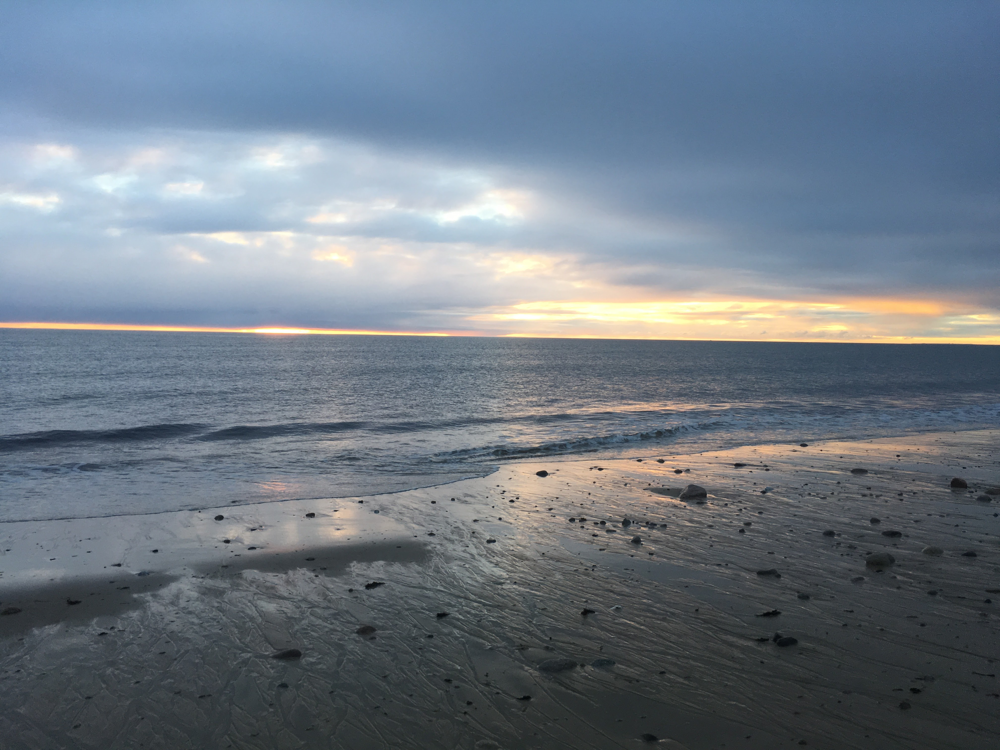

# Some Stuff I Like

My family is very close and important to me. We are Italian, and I love to learn how to cook traditional meals from my relatives.

In my free time, I love to get together with friends for movie & game nights, concerts & performances, family dinners, & late night conversations.

I LOVE to read ... everything. I keep a detailed catalogue of my personal library, which I store alphabetically. (Don't ask me to pick a favorite.)

Listening to music and podcasts are some of my favorite things to do to relax. I also love drawing and the visual arts. One of my favorite things to do in Philly is visiting the Philadelphia Museum of Art. I am also fairly advanced at knitting, and I've taken up embroidery during quarantine.

I have been figure skating since I was 5 and am a USFS Gold Medalist in Moves in the Field. I enjoy taking walks outdoors, especially to the beach, and I also dabble in iPhone photography. (Most of the pictures on this site were ones I took out on walks in the three places where I've spent large chunks of my life -- Sagamore Beach, MA; New Smyrna Beach, FL; Philadelphia, PA.)

I am very interested in ethics, specifically as it relates to new technologies. Questions regarding ethical AI and algorithms, rights to privacy, the regulation of big tech corporations, public health, the environment, and big data fascinate me.

I support Boston sports teams, and I love learning about the strategy behind sports.

Thanks for checking out my site, and don't hesitate to reach out!