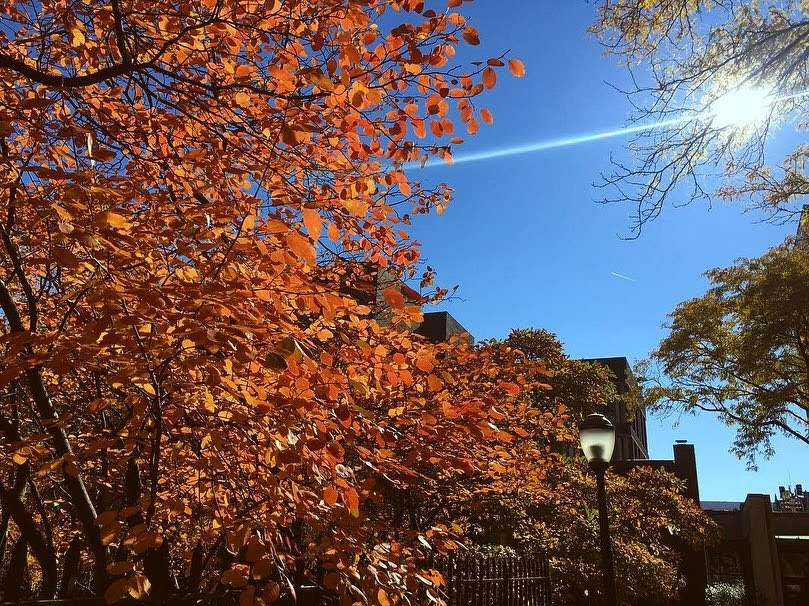

# Cognitive Computation Group @ UPenn

  
<b>Researcher</b>

*February 2019 - Present* 
The Cognitive Computation Group (CogComp) is one of the foremost research groups in the field of Natural Language Processing (NLP) run by Professor Dan Roth.

NLP is a branch of machine learning that combines linguistics with computer science to teach machines how to do tasks such as machine translation, information extraction, document summarization, and question answering (think Google search, chatbots, and recommendation systems).

I have been working as a researcher in this lab for nearly two years, both as a paid researcher and for academic credit through independent study. For more info about my research projects, please check out the Projects tab.
  

# Computer Science Dept. @ UPenn

  
<b>TA - CIS 262: Automata, Computability, & Complexity</b>

*August 2020 - December 2020* 
CIS 262 is an intermediate-level, proof-based computing theory course, which focuses on computation theory. It is the most abstract core requirement for CS students. As a TA, I hold weekly office hours, grade assignments, and answer questions on Piazza, an online class message board.
  

  
<b>TA - CIS 120: Programming Languages & Techniques</b>

*August 2019 - December 2019* 
CIS 120 is an introductory programming techniques course that is required for all CS majors at Penn. It teaches programming in Java and OCaml.

I taught a weekly, hour-long recitation class, and I held two hours of office hours per week to provide help with homework and general computer science concepts.

I graded assignments, performed code reviews where I met individually with students to discuss the code in their homework assignments. I proctored and graded exams. I served on a committee dedicated to answering questions from students on Piazza, where we fielded thousands of questions throughout the semester.
  

  
<b>TA - MCIT 592: Discrete Math</b>

*August 2019 - December 2019* 
MCIT 592 is an online, proof-based discrete math course designed for computer science Master's students who did not major in CS as undergraduates. I served as a grader for this course and as a resource to CS students, and was offered a head TA position.
  

# Brain Behavior Lab @ HUP

  
<b>Research Assistant</b>

*August 2018 - December 2018* 
I assisted the database programmer with improving the database interface for the research lab.
  

# Sallan Lab @ UPenn

  
<b>Research Assistant</b>

*May 2018 - August 2018* 
I helped construct a reliable fossil fish database to be used for future research analysis in the field of paleobiology.
  

# GH Bass Outlets @ Sagamore, MA

  
<b>Sales Associate</b>

*September 2016 - August 2017* 
I worked the register and the sales floor, stocked merchandise, and provided customer service.
  

